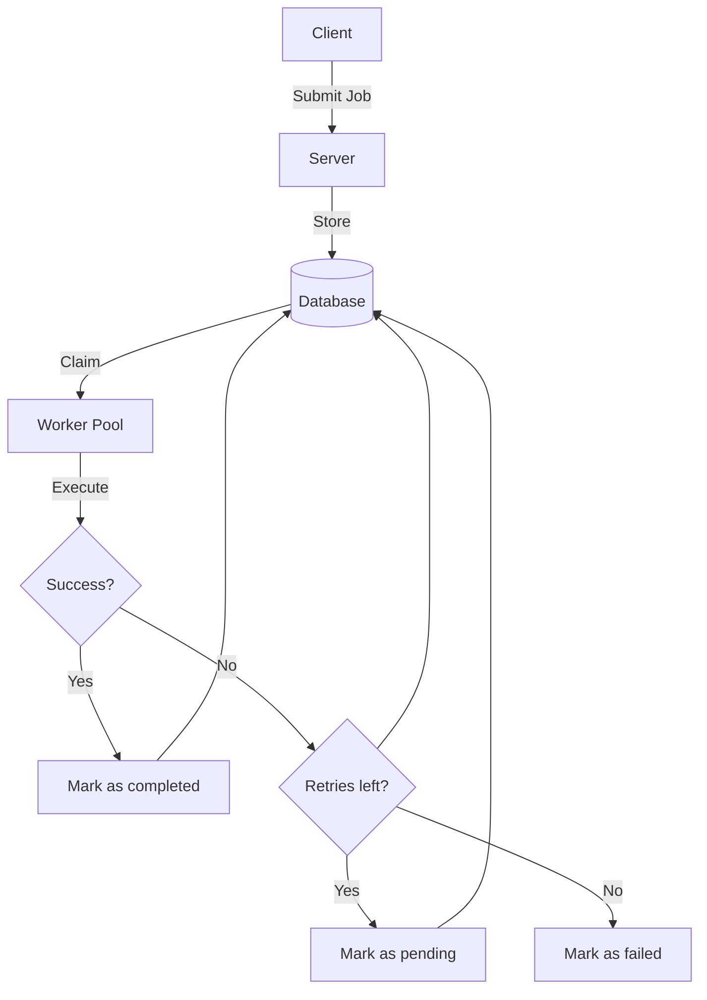

# Job Scheduler
A job scheduler system built in Rust for reliable background job processing.

## Architecture

## Technologies
- **Server:** Rust (tokio, axum)
- **Worker:** Rust (tokio)
- **Database:** PostgreSQL (sqlx)

## Current Implementation Status
**✅ Implemented:**
- Job submission via HTTP API
- Concurrent worker execution
- High priority jobs execute first
- Job status tracking (pending → running → completed/failed)
- Retry counter and max_retries enforcement
- Failed jobs marked after exhausting retries
- Observability (structured tracing/logs)

**🚧 TODO:**
- [ ] Exponential backoff between retries
- [ ] Dead letter queue table (failed jobs currently just marked `status='failed'`)
- [ ] Worker crash detection and job timeout
- [ ] Job query endpoints (GET /jobs/:id, GET /stats)
- [ ] Graceful shutdown
- [ ] Worker pool management
- [ ] Benchmarking & Profiling

**Current behavior:**
- Jobs stuck if worker crashes mid-execution
