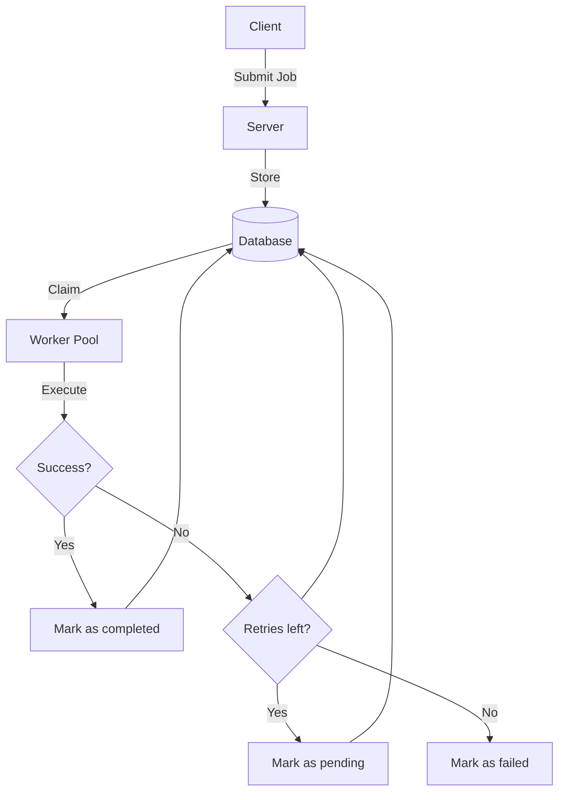

# Job Scheduler
A distributed job scheduler written in Rust for reliable background job processing with prioritization, retries, observability, lease-based execution, and process supervision.

# System Design
## 1. Requirements
#### Functional Requirements
- **Job Submission:** Allow clients to submit new jobs.
- **Job Claiming & Processing:** Workers must be able to claim the next available job and prevent other workers from processing the same job.
- **Priority-based job execution:** High priority jobs must run first.
- **Schedule jobs:** Allow clients to schedule jobs to run once or periodically (recurring/periodic jobs).
- **Error and Retry Mechanism:** Handle failures gracefully, retry the jobs which failed due to temporary errors and mark permanently failed or retry-exhausted jobs as failed jobs (dead letter queue).
- **Data Persistence:** Job information must be stored persistently to survive system restarts.

#### Non-Functional Requirements
- **Reliability:** Ensure that every job is processed atleast once, even in the event of worker or network failures.
- **Fault Tolerance:** If a worker crashes during processing, the job should eventually be released back into the queue for another worker to pick up.
- **Performance and Scalability:** The system should be able to handle a growing number of jobs and concurrent clients without significant degradation in performance.
- **Concurrency:** The system must support multiple workers processing jobs concurrently without any race conditions and duplicate processing.
- **Observability:** Log all job activities to faciliate monitoring and troubleshooting.

## 2. Core Entities
The system is modeled around these primary database tables.

- **Job:** Hot queue storing non-terminal jobs (pending, running, completed, failed)
- **Workers:** Tracks active worker processes and heartbeats

## 3. API Design
The server exposes REST APIs for job submission and interaction.
Example endpoints:
- **POST /jobs**: Submit a new job
- **GET /jobs/{id}**: Retrieve job status
- **GET /jobs**: List jobs

## 4. High-Level Design

```mermaid
graph TD
    A[Client] -->|Submit Job| B[Server]
    B -->|Store| C[(Database)]
    C -->|Claim| D[Worker Pool]
    D -->|Execute| E{Success?}
    E -->|Yes| F[Mark as completed]
    E -->|No| G{Retries left?}
    G -->|Yes| H[Mark as pending]
    G -->|No| I[Mark as failed]
    F --> C
    G --> C
    H --> C
```

## Features
### Implemented
- **📥 Job Submission API:** Submit Jobs via HTTP
- **💾 Durable job persistance:** Jobs are stored in database
- **⚡  Concurrent Workers:** Workers process jobs in parallel
- **🔼 Priority Scheduling:** High priority jobs are preferred
- **🔁 Retries & Backoff:** Exponential backoff for retrying jobs
- **🔐 Job Leasing:** Jobs are leased so stalled jobs can be reclaimed
- **🧹 Cleanup Task:** Jobs that made the worker crash are marked as failed via a background cleanup task. 
- **💀 Dead Letter Queue:** Jobs whose status is failed.
- **🚪 Graceful Worker Shutdown:** Workers stop accepting new jobs and if in mid-execution, complete the current job until it reaches a terminal status (completed/failed) before shutting down.
- **🧠 Worker Process Supervision:** A separate supervisor process spawns workers based on configuration, continuously monitors their exit status, and automatically respawns them if they crash.
- **🗓️ Scheduled jobs (One-time)**
- **📊 API to query job status & statistics**

### Planned Enhancements
- 🔁 Periodic / Recurring jobs
- 🖥️ Dashboard for real-time visualization
- 📈 Benchmarking & performance profiling

## Technologies
- **Server:** Rust (tokio, axum)
- **Worker:** Rust (tokio)
- **Database:** PostgreSQL (sqlx)

## Performance

**Benchmarks**
| Metric | Result |
| ------ | ------ |
| API Submission | 2185 jobs/sec |
| Email Processing | 169 jobs/sec (10 Workers) |
| Per-worker throughput | ~17 emails/sec |
| Average email latency | ~60ms per email |

**Test Conditions:**
- 10,000 emails to local Mailpit SMTP server
- 10 concurrent worker processes
- PostgreSQL connection pool: 50 connections (5 per worker)
- Platform: Lenovo Ideapad (Intel Core i3, 8GB RAM)
